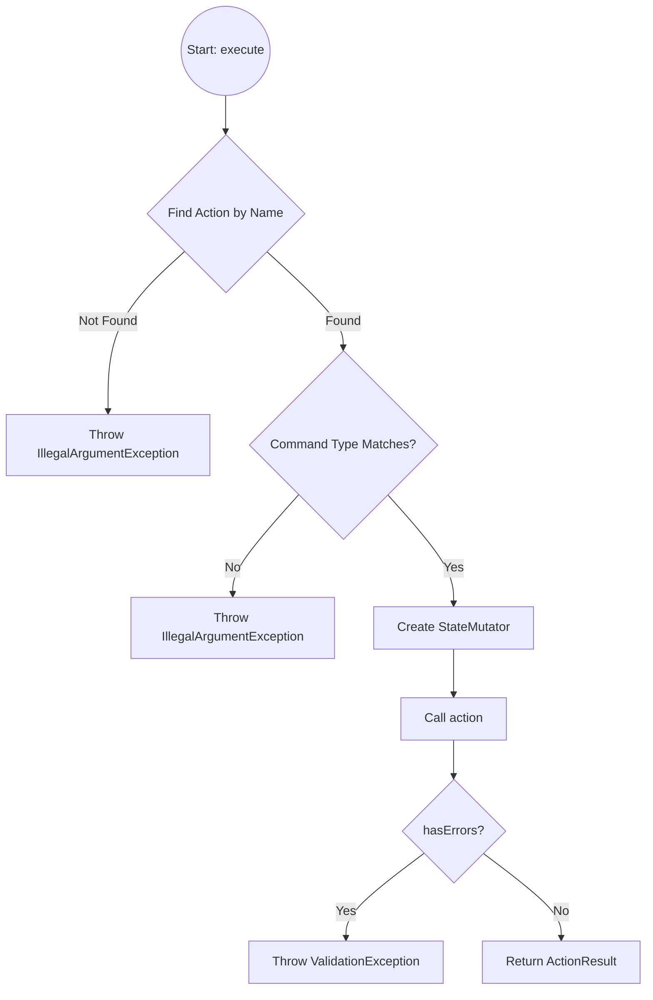

# Actions

Actions are operations that can be performed on an entity. In LibEntity, actions encapsulate business logic and are the primary way to trigger state transitions, update fields, or perform validations.

## What is an Action?

An **action** represents a business operation (such as "approve", "submit", or "reject") that can be performed on an entity. Actions are defined in your entity type using the DSL and are associated with:
- Allowed states (when the action is available)
- A command type (input data for the action)
- A handler (business logic to execute)
- Optional predicates (e.g., `onlyIf`) to further restrict availability

## Example: Defining an Action

```java
.action("approve", a -> a
    .allowedStates(Set.of(InvoiceState.PENDING))
    .commandType(ApproveInvoiceCommand.class)
    .handler((state, req, cmd, entity, mutator) -> {
        entity.setApproverId(cmd.getApproverId());
        mutator.setState(InvoiceState.APPROVED);
    })
)
```

## Action Handler Parameters

- `state`: The current state of the entity
- `req`: The request context (e.g., user info)
- `cmd`: The command object containing input data
- `entity`: The entity instance being mutated
- `mutator`: Used to change the entity's state or perform controlled mutations

## Action Availability

Actions can be restricted to certain states and further gated using the `onlyIf` predicate:

```java
.action("submit", a -> a
    .allowedStates(Set.of(InvoiceState.DRAFT))
    .onlyIf(entity -> entity.getAmount() != null && entity.getAmount().compareTo(BigDecimal.ZERO) > 0)
    // ...
)
```

## Why Use Actions?

- Centralize business logic
- Make state transitions explicit
- Enforce validation and security rules regardless of request source
- Enable dynamic discovery of available actions (see advanced features)

## Action Execution

Actions are executed by calling the `execute` method of the provide implementation of `ActionExecutor<S, R>`. The default implementation provided by `SyncActionExecutor<S, R>` works as follows:



If the default implementation of `ActionExecutor` is not sufficient, you can provide your own implementation of `ActionExecutor<S, R>`.