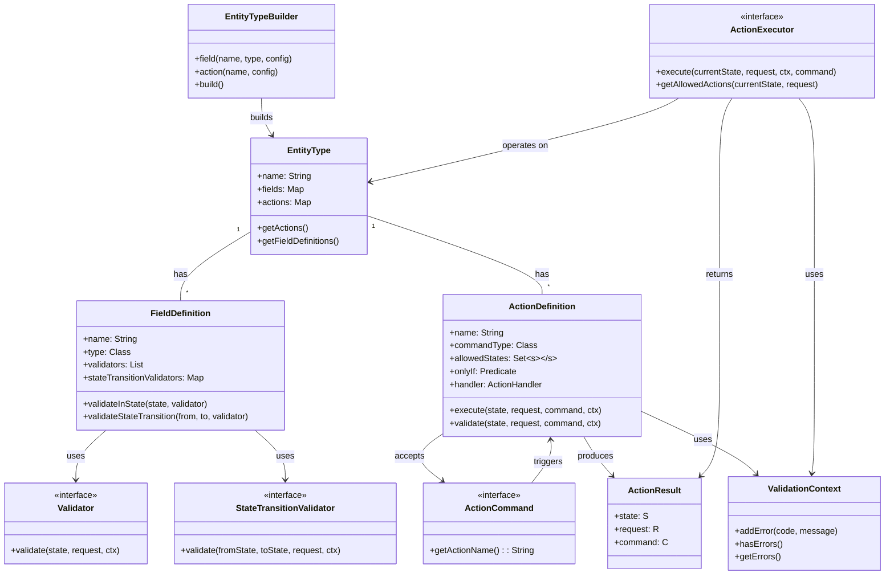

# What is LibEntity?

LibEntity is a powerful (and fun!) Java library for building type-safe, state-driven business entities with validation and action handling. It provides a clean, expressive DSL for defining entities, their states, fields, and actions. It's like Spring Boot for your business rules, but with more good vibes and less boilerplate!

## lib-entity vs Traditional Hexagonal Architecture

| Feature/Aspect           | lib-entity                                                                  | Traditional Hexagonal Architecture (Hand-Made)        |
| ------------------------ | --------------------------------------------------------------------------- | ----------------------------------------------------- |
| **Boilerplate**          | Minimal: most patterns, wiring, and validation are handled by the framework | High: manual wiring, repetitive code, lots of classes |
| **Business Logic Focus** | DSL lets you focus on rules, states, and actions, not on plumbing           | Business logic often mixed with infrastructure code   |
| **Extensibility**        | Easily add actions, validations, fields, or states declaratively            | Requires manual changes across multiple layers        |
| **Validation & Actions** | Built-in, composable, and reusable via DSL                                  | Custom, often duplicated, and scattered               |
| **Testability**          | Entities and actions are isolated, easy to mock and test                    | Test setup is verbose, mocking can be complex         |
| **Consistency**          | Enforced by the framework and DSL, less room for error                      | Depends on developer discipline                       |
| **Learning Curve**       | Beginner-friendly, especially for new team members                          | Steep: must learn patterns, best practices, wiring    |
| **DSL/Declarative**      | Fluent, type-safe, and self-documenting                                     | Imperative, verbose, and error-prone                  |
| **Integration**          | Out-of-the-box integration with Spring, validation, and more                | Must integrate and maintain dependencies manually     |
| **Maintainability**      | High: changes in one place, less code rot                                   | Medium/Low: changes ripple through many files         |

## Metamodel

A metamodel is a model of a model. In the context of LibEntity, a metamodel is a model of your entity types. The prebuilt metamodel brings structure to your services while keeping good flexibility and a exit path at any point in time.

LibEntity metamodel is as follows:

### Core Pieces

| Component                    | Description                                                                         |
|-----------------------------|-------------------------------------------------------------------------------------|
| **ActionExecutor**          | Interface for executing actions based on incoming commands and the current state of the entity. |
| **EntityType**             | Core configuration of an entity, containing fields, actions, and their definitions. |
| **EntityTypeBuilder**      | DSL builder for fluently configuring entities with fields, actions, and validations. |
| **FieldDefinition**        | Defines a field's type, validators, and state transition rules. |
| **ActionDefinition**       | Defines an action's command type, allowed states, conditions (onlyIf), and handler. |
| **ActionCommand**          | Interface for commands that trigger actions on entities. |
| **ActionResult**           | Result of an action execution containing new state, modified request, and command. |
| **ValidationContext**      | Collects validation errors during action execution and field validation. |
| **Validator**              | Interface for field validators that run in specific states. |
| **StateTransitionValidator** | Interface for validators that run during state transitions. |

> **Summary:** > `lib-entity` lets you build robust, maintainable, and testable domain logic with far less code and cognitive overhead. You get all the benefits of Hexagonal Architecture, but with a declarative, beginner-friendly approach and much less boilerplate. Perfect for teams who value both flexibility and productivity.

